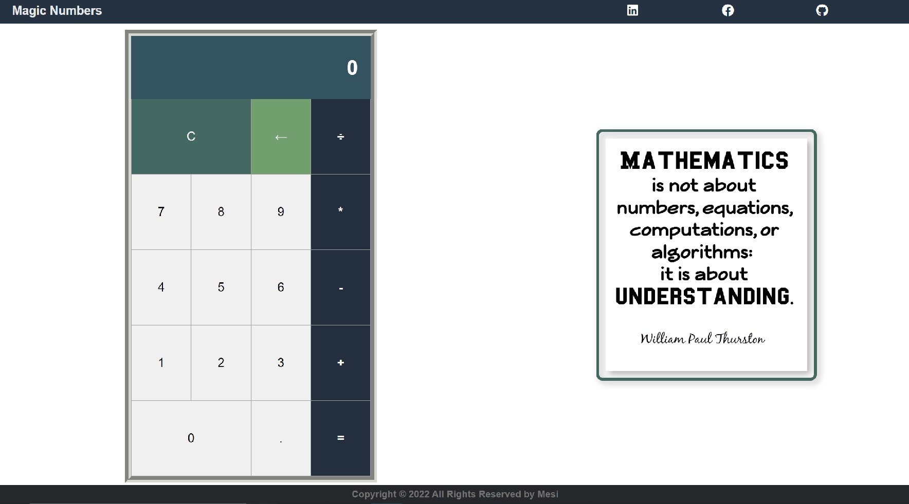

# Magic-Numbers


This project is about making a calculator app using Javascript. Operations can be performed from the keyboard.
It can solve basic operations. 

---



## Live version

For the live version of this project visit the following [link](https://mesi21.github.io/Magic-Numbers/) 

## Get started

```bash
   git clone git@github.com:Mesi21/Magic-Numbers.git
   cd into the folder by typing: cd Magic-Numbers
```

 :heavy_plus_sign: add your contribution if you'd like
 And please feel free to make a PR

## Technology

- Javascript
- HTML && CSS

## Contributor:

- [Molnar Emese](https://github.com/Mesi21)

## Future functionalities:

Perform more advanced calculations.

## Show your support:

Give a :star: if you like the app
